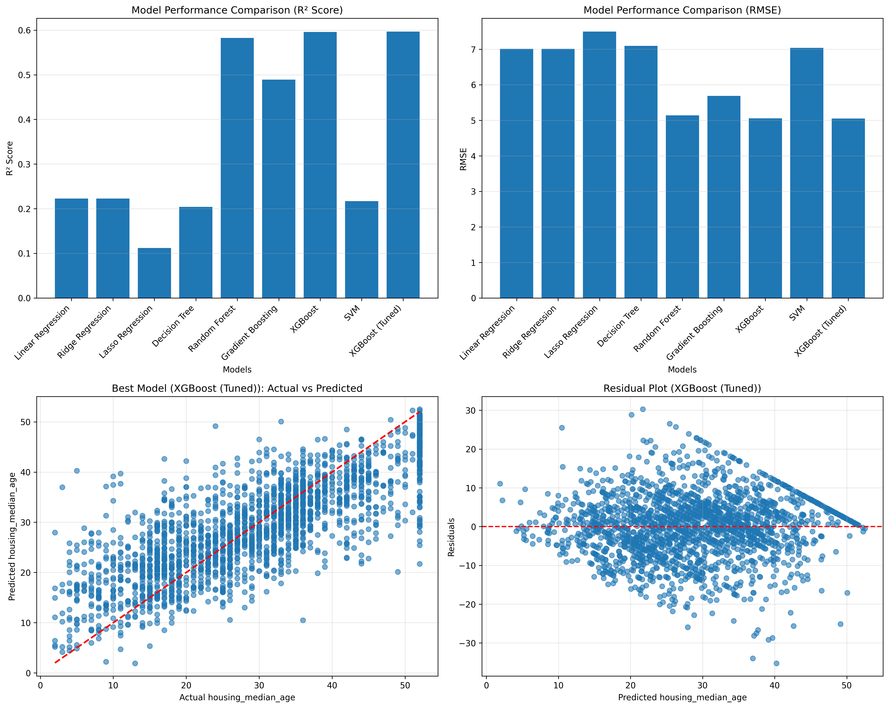

# Porblem Statement ID : 25068
# Problem Statement Title : Real time groundwater resource evaluation using DWLR data.

# Groundwater Data Fetcher CLI (Backend Prototype)

## Team Details

| Name            | Role                   |
|-----------------|------------------------|
| Yugh Juneja     | Team Leader – AI/ML    |
| Aditya Raj      | Backend                |
| Rishaub Kumar   | Backend                |
| Palak Narang    | Presentation           |
| Nancy Sharma    | Frontend               |
| Rohit Deka      | Frontend               |


### Working Prototype Demo (Frontend + Backend)

<video controls src="https://github.com/TheArkhamBat/groundwater-cli-app/raw/main/prototype_demo.mp4" style="max-width: 100%;">
    Your browser does not support the video tag.
</video>

### Demo Video : https://drive.google.com/file/d/1vQBwRFu9rRaDdjgtucFipbJQWe3Wpq1C/view?usp=sharing

The working prototype can be found here : (https://github.com/OoONANCY/AquaMonitor).

### CLI Application Demo

<video controls src="https://github.com/TheArkhamBat/groundwater-cli-app/raw/main/demo.mp4" style="max-width: 100%;">
    Your browser does not support the video tag.
</video>

### Demo Video: https://drive.google.com/file/d/11CRSrbW2eqzbhIHw6gRsfNDaHetHZ9St/view?usp=sharing

## Project Overview

Fetches data from India-WRIS API to create and use json data for anaylsis and prediction of groundwater level in all districts of India. This project is a backend prototype for fetching and visualizing groundwater level data from the official India-WRIS (Water Resources Information System of India) public API. It is built as a command-line interface (CLI) tool using Python, allowing users to specify a location and date range to generate a time-series plot of the water levels.

## Features

* **Command-Line Interface:** Uses `Typer` to provide a clean, user-friendly CLI for interacting with the application.
* **API Integration:** Fetches data by making POST requests to the India-WRIS API endpoint.
* **Dynamic Data Fetching:** Accepts user inputs for state, district, and a start/end date range to retrieve specific datasets.
* **Data Processing:** Parses the JSON response from the API and loads it into a `pandas` DataFrame for manipulation and analysis.
* **Data Visualization:** Generates and displays a time-series line graph of the groundwater levels using `matplotlib` and `seaborn`.

### ML MODEL TRAINED ON DATASET FOR PREDICTING FUTURE GROUNDWATER LEVELS

Data Collection & Integration: Real-time inputs from over 50,000 records and 5,000+ DWLR stations were integrated with rainfall APIs to create a comprehensive dataset.

Target Variable: The model's objective is to predict the 'housing_median_age'.

Dataset Size: The final processed dataset contains 50,042 samples with 959 features.

Data Splitting: The dataset was split into a training set (45,037 samples) and a test set (5,005 samples) to evaluate model performance.

Model Training: A total of eight regression models were trained, including Linear, Ridge, Lasso, Decision Tree, Random Forest, Gradient Boosting, XGBoost, and SVM.

Best Initial Model: XGBoost emerged as the best initial model with an R² score of 0.5959.

Hyperparameter Tuning: The XGBoost model was further optimized through hyperparameter tuning, resulting in a slight performance improvement.

Final Model Performance: The final, tuned XGBoost model achieved an R² score of 0.5965, a Root Mean Squared Error (RMSE) of 5.05, and a Mean Absolute Error (MAE) of 2.45




## How to Use

This tool is designed to be run from the command line within a Python virtual environment.

1.  **Create and Activate Environment:** Create a Python virtual environment and activate it.
    ```bash
    # Create the environment
    python -m venv venv
    # Activate the environment (Linux/macOS)
    source venv/bin/activate
    ```

2.  **Install Dependencies:** Install the required Python libraries using pip.
    ```bash
    pip install "typer[all]" requests pandas matplotlib seaborn
    ```

3.  **Run the Tool:** Execute the script with the required command-line options.
    ```bash
    python groundwater_cli.py --state "Odisha" --district "Baleshwar" --start-date "2023-11-01" --end-date "2024-10-31"
    ```

## Core Dependencies

* **typer**: For building the command
